# Android Studio Review

In this Page, we will have all the material covered with some code snippets. 

In case you forgot where to find the documentation, please find them in the links below:

Android Studio Documentation - https://developer.android.com/docs

Kotlin Documentation - https://kotlinlang.org/docs/home.html


# Snackbar and Toast

for a Snackbar, create an ID for your main layout and use the code snippet below:

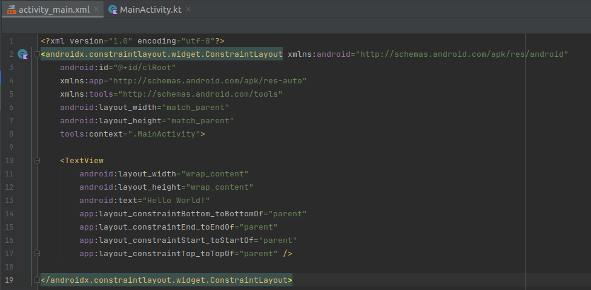 


```bash
    val myLayout = findViewById<ConstraintLayout>(R.id.clRoot)
    Snackbar.make(myLayout,"Your-Text_Goes-here",Snackbar.LENGTH_LONG).show()
```

for a Toast, use the following code snippet and pay attention that we don't pass "myLayout"
instead, we pass "this"

```bash
    Toast.makeText(this,"Your-Text_Goes-here",Toast.LENGTH_LONG).show()
```

# Activity Lifecycle

Refer to the following links for the Lifecycle diagram and documentation:

https://developer.android.com/guide/components/activities/activity-lifecycle


to be revisted 


# Menus

To create a menu, we first have to create its XML file.

Right click on the res folder, click New, and select Android Resource Files.

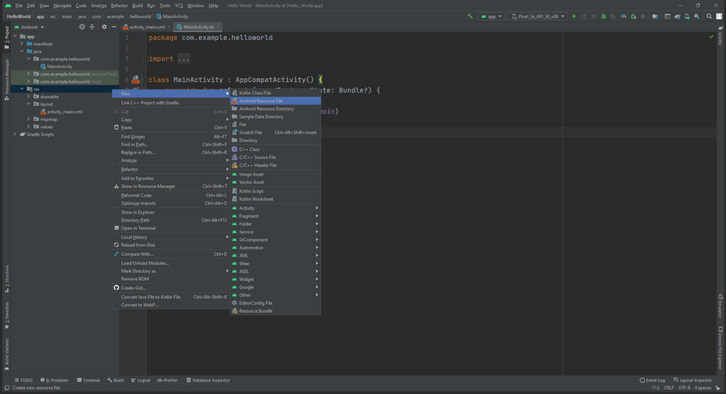 

Next, we will name our menu main_menu and select Menu under Resource Type.

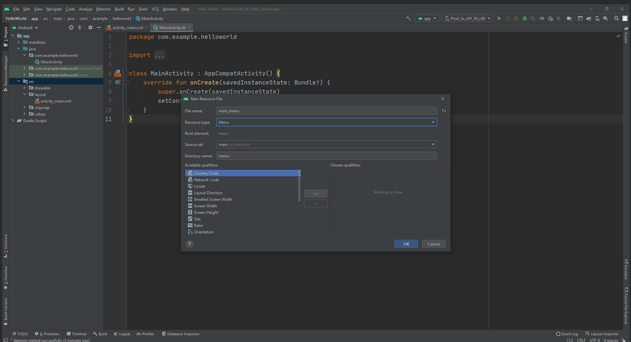 

Clicking OK will create the menu file.

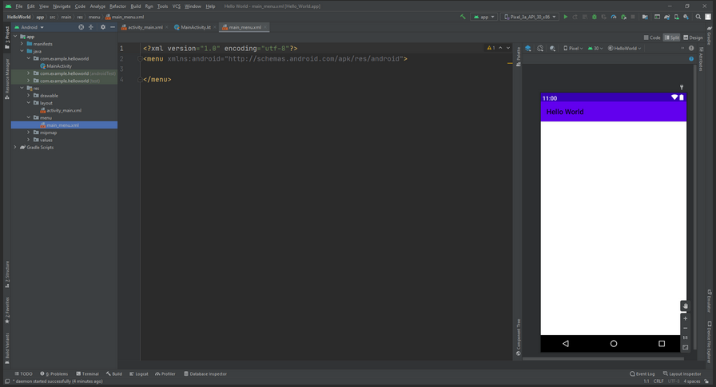

Now, we can create individual options for our menu. We will create two items; a Hi Message, and a Bye Message.

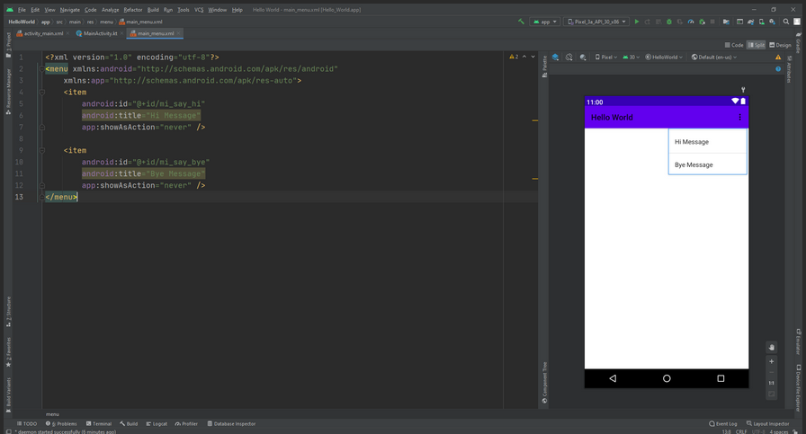 

We provide each item with an id, a title, and a command to never show it as an action. If we set showAsAction to true, our two messages will appear alongside each other in the menu tab. Here, we only see them if the user taps on the three dots to open the menu options.

Finally, we inflate the menu and add functionality to the options by overriding two methods.

Finally, use the following code snippet and adjust the IDs:

```bash
        override fun onCreateOptionsMenu(menu: Menu?): Boolean {
	    menuInflater.inflate(R.menu.main_menu, menu)
	    return true
    }
    override fun onOptionsItemSelected(item: MenuItem): Boolean {
	    when(item.itemId){
		    R.id.mi_say_hi -> {
			    Snackbar.make(clMain, "Hello there!", Snackbar.LENGTH_SHORT).show()
			    return true
	    	}
		    R.id.mi_say_bye -> {
			    Snackbar.make(clMain, "Goodbye", Snackbar.LENGTH_SHORT).show()
			    return true
		    }
	    }
	    return super.onOptionsItemSelected(item)
    } 
```

we covered how to add a menu to an application with one activity. Let us now have a look at how we can share a menu between multiple activities.
We will add a second activity to our application, make use of the same menu, then make some changes to it.

we can change the menu option inside the new myActivity, we will override the onPrepareOptionsMenu.
We now have access to the different menu items. We will change the text of these items to be different in the second activity.

use the following code snippet to change the menu in the new activity ( look at the onPrepareOptionsMenu override)

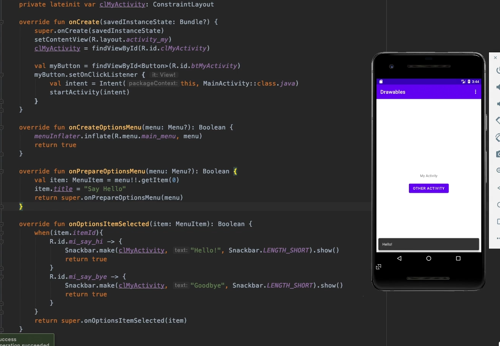

# Alert Dialogs

The best practice is to call the Alert Dialog function after we create it using the following code snippet:

```bash
    private fun customAlert(){
    
        // first we create a variable to hold an AlertDialog builder
        val dialogBuilder = AlertDialog.Builder(this)

        // then we set up the input
        val input = EditText(this)

        // here we set the message of our alert dialog
        dialogBuilder.setMessage("Enter your message:")

            // positive button text and action
            .setPositiveButton("Submit", DialogInterface.OnClickListener {
                    dialog, id -> messages.add(input.text.toString())
            })

            // negative button text and action
            .setNegativeButton("Cancel", DialogInterface.OnClickListener {
                    dialog, id -> dialog.cancel()
            })

        // create dialog box
        val alert = dialogBuilder.create()

        // set title for alert dialog box
        alert.setTitle("New Message")

        // add the Edit Text
        alert.setView(input)

        // show alert dialog
        alert.show()
    }  
```
Then, we call the function whenever we need an AlertDialog by using:

```bash
    customAlert()
```

# Recycler View - using findViewById

first, we need to add the following plugin to the top of our gradle-module build file:

```bash
    id 'kotlin-android-extensions' 
```

then we create an XML file to use as a template for each item "item_row", thoe following Images show the steps:

* make sure the Layout is created as "LinearLayout"
* make sure the height of the LinearLayout is "wrap_content"
* create a textView and give the text view an ID

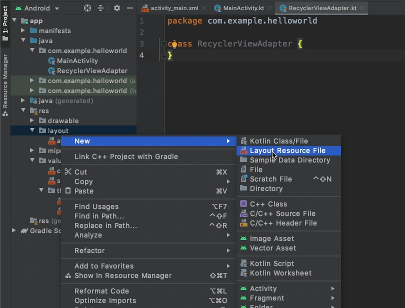

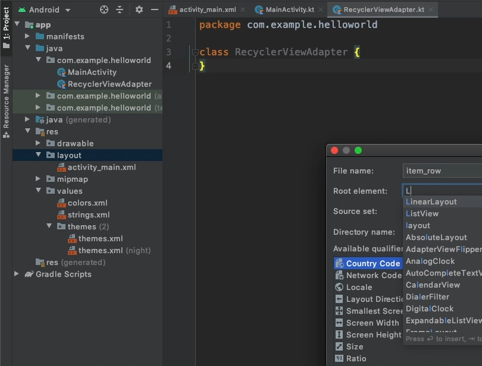

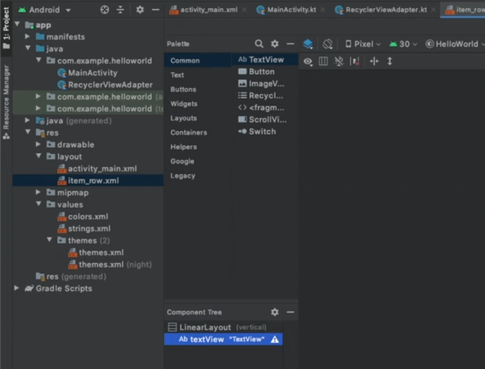

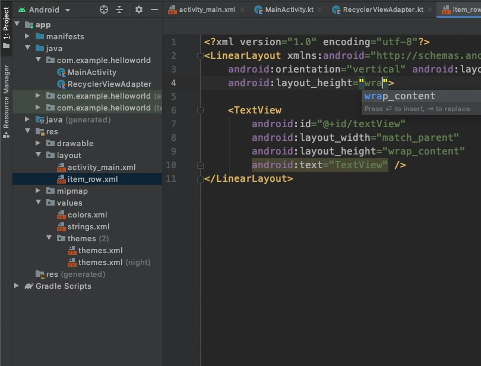

create a class as shown in the following images:

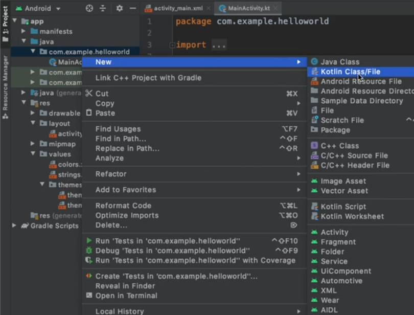

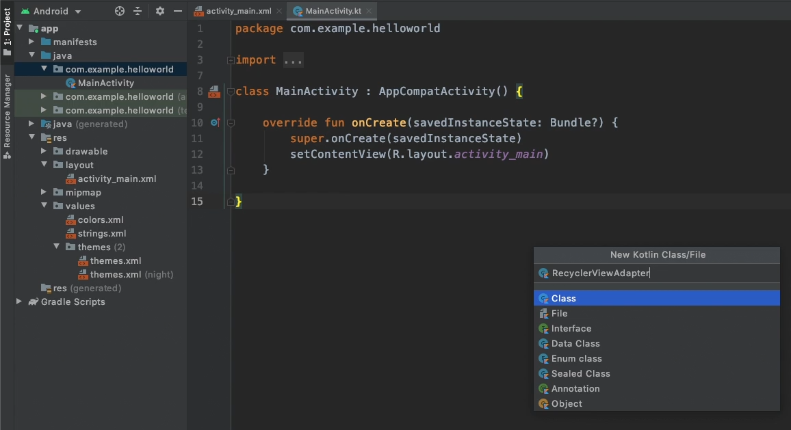

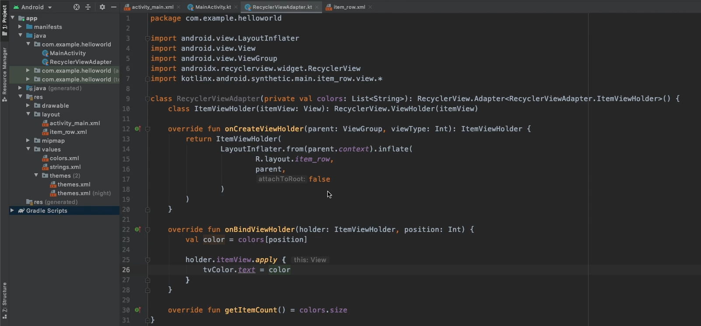

now, we need to creat a recyclerview in our mainActivity, let's assume the ID for the recycler view is: rvMain;
we need to plug the adapter"class" we created to the adapter view as follows:

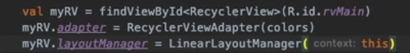


# Recycler View - updated

First, we need to add the following to our build.gradle file:

```bash
        android {
            ...
            buildFeatures {
                viewBinding true
            }
        }    
```

Now we need to make a few changes to how we create our Recycler View Adapter.

```bash
package com.example.helloworld
import android.view.LayoutInflater
import android.view.ViewGroup
import androidx.recyclerview.widget.RecyclerView
import com.example.helloworld.databinding.ItemRowBinding
class RecyclerViewAdapter(private val colors: List<String>): RecyclerView.Adapter<RecyclerViewAdapter.ItemViewHolder>() {
    class ItemViewHolder(val binding: ItemRowBinding): RecyclerView.ViewHolder(binding.root)
    override fun onCreateViewHolder(parent: ViewGroup, viewType: Int): ItemViewHolder {
        return ItemViewHolder(
            ItemRowBinding.inflate(LayoutInflater.from(parent.context), parent, false)
        )
    }
    override fun onBindViewHolder(holder: ItemViewHolder, position: Int) {
        val color = colors[position]
        holder.binding.apply {
            tvColor.text = color
        }
    }
    override fun getItemCount() = colors.size
}    
```

Finally, we make a few more changes when we initialize the Recycler View.

```bash
package com.example.helloworld
import androidx.appcompat.app.AppCompatActivity
import android.os.Bundle
import androidx.recyclerview.widget.LinearLayoutManager
import androidx.recyclerview.widget.RecyclerView
class MainActivity : AppCompatActivity() {
    private lateinit var myRV: RecyclerView
    private lateinit var rvAdapter: RecyclerViewAdapter
    override fun onCreate(savedInstanceState: Bundle?) {
        super.onCreate(savedInstanceState)
        setContentView(R.layout.activity_main)
        val colors = listOf("Red", "Green", "Blue", "Purple", "Cyan", "Orange", "Yellow", "Pink", "Silver", "Black")
        myRV = findViewById(R.id.rvMain)
        rvAdapter = RecyclerViewAdapter(colors)
        myRV.adapter = rvAdapter
        myRV.layoutManager = LinearLayoutManager(this)
    }
}
```
Now our code no longer uses a deprecated plugin, making it more future proof. 


# Saving / Restoring Instance States

Saving and restoring instances allows us to enable screen rotation without having to worry about losing data.

If we do not handle instance states, our application will restart each time the device is rotated.

In this example, we are assuming two variables exist; an integer called someNumber, and a string called myMessage.

To save our instance we need to override the onSaveInstanceState method. Add the following code under the onCreate method.

```bash
        override fun onSaveInstanceState(outState: Bundle) {
        super.onSaveInstanceState(outState)
        outState.putInt("myNumber", someNumber)
        outState.putStringArrayList("myMessage", myMessage)
    }   
```
In order to restore our instance we override the onRestoreInstanceState.

```bash
    override fun onRestoreInstanceState(savedInstanceState: Bundle) {
        super.onRestoreInstanceState(savedInstanceState)
        someNumber= savedInstanceState.getInt("myNumber", 0)
        myMessage = savedInstanceState.getString("myMessage", "No Message")
    }  
```

# Shared Preferences

Shared Preferences allow us to save data to the user's device. We can then load the data when we launch our application.

To use Shared Preferences, we first have to declare our Shared Preferences variable.

```bash
        private lateinit var sharedPreferences: SharedPreferences 
```

Once we initialize Shared Preferences, we can load and save data.

But before we do that, let's add the following line to our strings.xml file.

```bash
        <string name="preference_file_key">com.example.helloworld.PREFERENCE_FILE_KEY</string> 
```

Now we can refer to the Shared Preferences string.

```bash
        sharedPreferences = this.getSharedPreferences(
	        getString(R.string.preference_file_key), Context.MODE_PRIVATE)
        myMessage = sharedPreferences.getString("myMessage", "")  // --> retrieves data from Shared Preferences

        // We can save data with the following code
        with(sharedPreferences.edit()) {
            putString("myMessage", myMessage)
            apply()
} 
```

# Intents

Intents allow us to launch a new activity in Android Studio. 

First let's have a look at how to create a new Activity.

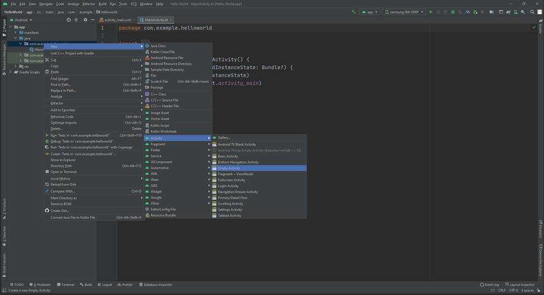

Next, we name our activity.

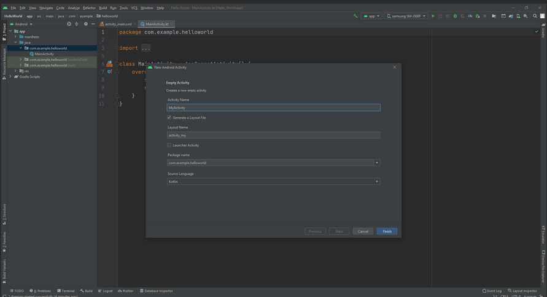

Finally, we add the following code in order to move from our Main Activity to the newly created My Activity:

We will assume that activity_main.xml contains a button, which we will initialize. We will then add an OnClickListener that will make use of an intent to move to My Activity whenever the button is pressed.

```bash
        myButton.setOnClickListener {
	        val intent = Intent(this, MyActivity::class.java)
	        startActivity(intent)
        } 
```

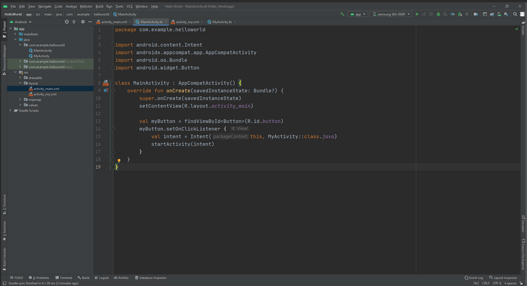

# Floating Action Button

A Floating Action Button 'hovers' over other views. This keeps it in place no matter what is happening with the rest of our activity.

First we need to create a new drawable to use with our Floating Action Button. In this example, we already have an edit_icon that we will use.

Next, we search for the Floating Action Button in the top-left corner.

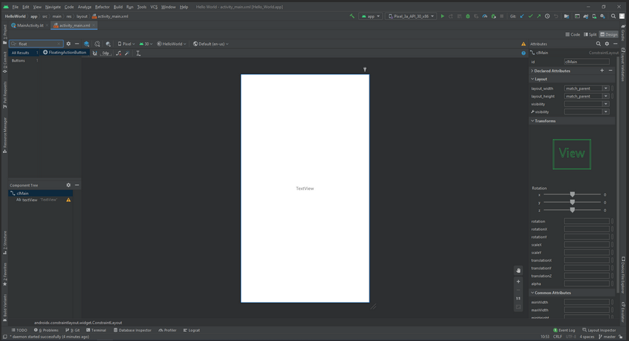

Once we drag the button into our Constraint Layout, we need to select an icon for the button. We will use the edit_icon.

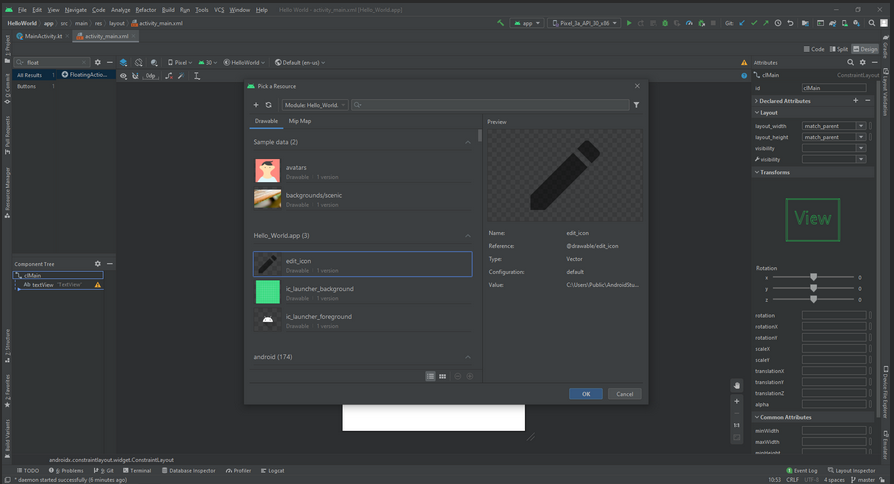

We can now place our Floating Action Button and add margins to give it some space.

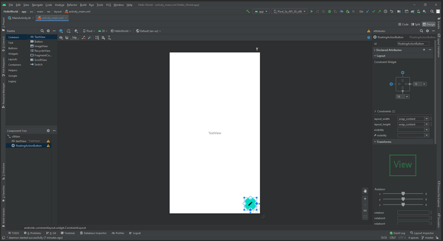

Go into MainActivity.kt and initialize the Floating Action Button. Then add an OnClickListener that does what you want once the button is pressed.
